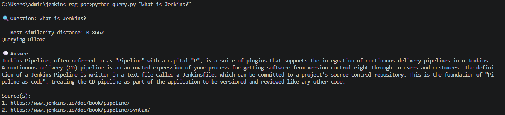
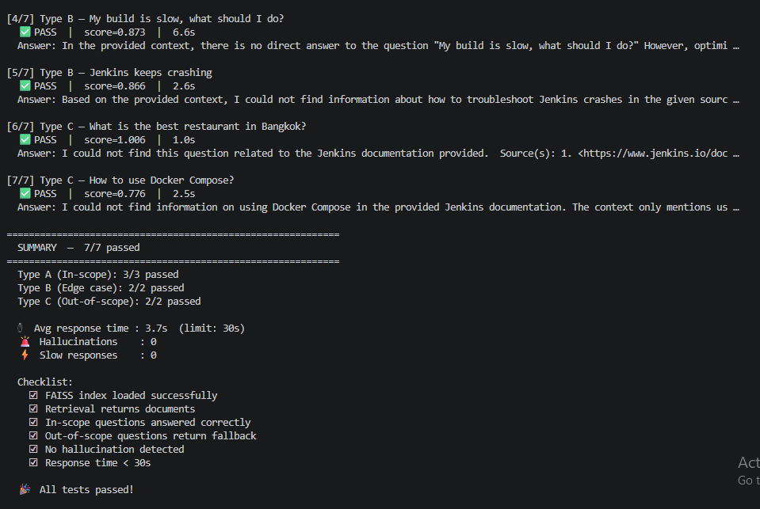

# Jenkins Documentation RAG — Proof of Concept

> **GSoC 2026 PoC** for the Jenkins AI Chatbot Plugin
> Related PR: [jenkinsci/resources-ai-chatbot-plugin#318](https://github.com/jenkinsci/resources-ai-chatbot-plugin/pull/318)

A fully local Retrieval-Augmented Generation (RAG) system that answers questions about Jenkins by grounding every response in the official Jenkins documentation and selected plugin pages. If the answer is not supported by the indexed sources, it falls back instead of guessing.

Runs 100% locally using [Ollama](https://ollama.com) — no cloud API or API key required.

---

## Architecture

```
Jenkins Docs + Plugin Pages (12 pages)
        │
        ▼
   ingest.py
  ┌──────────────────────────────────────┐
  │ 1. Crawl pages (BeautifulSoup)       │
  │ 2. Chunk text (500 tok / 50 overlap) │
  │ 3. Embed (Ollama nomic-embed-text)   │
  │ 4. Store → FAISS index on disk       │
  │ 5. Save raw chunks for BM25          │
  └──────────────────────────────────────┘
        │
        ▼  (jenkins_index/)
   query.py
  ┌──────────────────────────────────────┐
  │ 1. Load FAISS + raw chunks           │
  │ 2. Build BM25                        │
  │ 3. Hybrid retrieve top-3 chunks      │
  │ 4. Support / threshold checks        │
  │ 5. Mistral → grounded answer         │
  │ 6. Final fallback safety net         │
  └──────────────────────────────────────┘
```

---

## Indexed Documentation Pages

| Page | URL |
|---|---|
| Pipeline Overview | https://www.jenkins.io/doc/book/pipeline/ |
| Jenkinsfile | https://www.jenkins.io/doc/book/pipeline/jenkinsfile/ |
| Pipeline Syntax | https://www.jenkins.io/doc/book/pipeline/syntax/ |
| Using Credentials | https://www.jenkins.io/doc/book/using/using-credentials/ |
| Monitoring | https://www.jenkins.io/doc/book/system-administration/monitoring/ |
| Troubleshooting | https://www.jenkins.io/doc/book/troubleshooting/ |
| Managing Jenkins | https://www.jenkins.io/doc/book/managing/ |
| Managing Plugins | https://www.jenkins.io/doc/book/managing/plugins/ |
| Reverse Proxy Troubleshooting | https://www.jenkins.io/doc/book/system-administration/reverse-proxy-configuration-troubleshooting/ |
| Workflow Aggregator Plugin | https://plugins.jenkins.io/workflow-aggregator/ |
| Git Plugin | https://plugins.jenkins.io/git/ |
| Kubernetes Plugin | https://plugins.jenkins.io/kubernetes/ |

---

## Prerequisites

- Python 3.10+
- [Ollama](https://ollama.com) installed and running
- Required Ollama models pulled:

```bash
ollama pull nomic-embed-text   # embedding model (~270 MB)
ollama pull mistral             # LLM for answering (~4.4 GB)
```

---

## Installation

```bash
# 1. Clone the project
git clone <your-repo-url>
cd jenkins-rag-poc

# 2. Create and activate a virtual environment
python -m venv .venv
source .venv/bin/activate        # Windows: .venv\Scripts\activate

# 3. Install dependencies
pip install -r requirements.txt

# 4. Configure (optional — defaults work out of the box)
cp .env.example .env
# Edit .env only if Ollama runs on a non-default URL or you want a different model
```

---

## Running

### Step 1 — Ingest (run once, or whenever docs change)

```bash
python ingest.py
```

Expected output:
```
=== Jenkins RAG — Ingestion Pipeline ===

[1/4] Crawling Jenkins documentation pages …
  Fetching: https://www.jenkins.io/doc/book/pipeline/
    → 45,210 characters
  ...
      Total pages fetched: 12

[2/4] Splitting text into chunks …
      Total chunks: 312

[3/4] Creating embeddings with Ollama (nomic-embed-text) …
[4/4] Building FAISS index and saving to disk …
      Index saved → 'jenkins_index/'

✅ Ingestion complete!
   312 chunks across 12 pages indexed.
```

### Step 2 — Query

```bash
# Windows
set KMP_DUPLICATE_LIB_OK=TRUE
python query.py "<your question here>"

# macOS / Linux
python query.py "<your question here>"
```

### Step 2b — Streamlit UI

```bash
streamlit run app.py
```

### Step 3 — Quality Check (optional)

Run the full automated test suite (32 questions across 3 types):

```bash
python test_quality.py
```

---

## Example Queries

### In-scope — Jenkinsfile basics

```bash
python query.py "What is a Jenkinsfile and why should I use it?"
```



### In-scope — Parallel stages

```bash
python query.py "How to run parallel stages in Jenkins?"
```

### Out-of-scope — Fallback demonstration

```bash
python query.py "What is the best restaurant in Bangkok?"
```

```
🔍 Question: What is the best restaurant in Bangkok?

   Best similarity distance: 4.9201

💬 Answer:
I could not find this in the Jenkins documentation.
```

---

## Quality Test Results

Running `python test_quality.py` evaluates:
- Type A: in-scope Jenkins questions
- Type B: out-of-scope questions that should fallback
- Type C: hallucination-trap questions that should fallback

The current target is a full pass across all 32 test cases.



---

## Project Structure

```
jenkins-rag-poc/
├── ingest.py           # Crawl → chunk → embed → save FAISS + raw chunks
├── query.py            # Load index → hybrid retrieve → Mistral → answer
├── app.py              # Streamlit chat UI
├── test_quality.py     # Automated quality check (Type A / B / C)
├── requirements.txt    # Python dependencies
├── .env.example        # Config template (copy to .env)
├── .env                # Your local config (git-ignored)
└── jenkins_index/      # Generated FAISS index (git-ignored)
    ├── index.faiss
    ├── index.pkl
    └── chunks.pkl
```

---

## Configuration

All settings are in `.env` (copy from `.env.example`):

| Variable | Default | Description |
|---|---|---|
| `OLLAMA_BASE_URL` | `http://localhost:11434` | Ollama server URL |
| `OLLAMA_EMBEDDING_MODEL` | `nomic-embed-text` | Embedding model name |
| `OLLAMA_LLM_MODEL` | `mistral` | Generation model name |
| `SIMILARITY_THRESHOLD` | `1.5` | Retrieval distance threshold before fallback |

Shared retrieval, prompting, and fallback logic now lives in `rag_core.py`, so the CLI, UI, and quality checks use the same behavior.

---

## How Hallucination Is Prevented

The current pipeline uses multiple layers of protection:

1. **Hybrid retrieval** — FAISS handles semantic similarity and BM25 helps with exact keywords such as plugin names.
2. **Similarity threshold** — weak dense matches are rejected before generation.
3. **Question-support check** — the retrieved content must contain enough evidence for the important query terms.
4. **Strict system prompt** — the LLM is told to answer only from the retrieved context.
5. **Safety net** — unsupported response patterns are normalized back to the standard fallback message.

Fallback message:

```text
I could not find this in the Jenkins documentation.
```

---

## Security Notes

- `.env` is **never** committed to version control.
- No API keys or cloud credentials required — all inference runs locally via Ollama.
- The system prompt prevents the LLM from using knowledge outside the retrieved context.

---

## Related Resources

- [jenkinsci/resources-ai-chatbot-plugin PR #318](https://github.com/jenkinsci/resources-ai-chatbot-plugin/pull/318)
- [Jenkins GSoC 2026 — AI Chatbot to Guide User Workflow](https://www.jenkins.io/projects/gsoc/2026/project-ideas/ai-chatbot-to-guide-user-workflow/)
- [Jenkins Documentation](https://www.jenkins.io/doc/)
- [Ollama](https://ollama.com)
- [LangChain FAISS integration](https://python.langchain.com/docs/integrations/vectorstores/faiss/)
